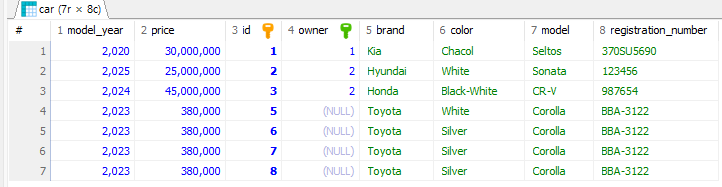

# SpringBoot Project 생성
https://stsart.spring.io
Gradle - Groovy
Java
3.5.6
Artifact com.example.cardatabase
Jar
17

Springboot의 간단 설명
Entity의 개념
JPA가 그래서 Entity와 어떻게 연결되어있고, inmemory database인 h2와 어떻게 연결이 되는지 여부도 수업.
build.gradle / application.properties라고 하는 파일들에 명령어들을 작성하게 됐습니다.

Entity 클래스의 경우에는 DB에서의 table 역할을 함.
Entity 클래스의 field들은 column 역할을 함.
JPA와 연동 되어있기 때문에 필수적으로 기본 생성자를 요구함.
id값을 AUTO로 잡아놨기 때문에(즉, 생성될 때마다 db에서 고유 id값을 부여하기 때문에)
@AllArgsConstructor를 적용하면 오류가 발생합니다.
```java
package com.example.cardatabase.domain;

import jakarta.persistence.Entity;
import jakarta.persistence.GeneratedValue;
import jakarta.persistence.GenerationType;
import jakarta.persistence.Id;
import lombok.RequiredArgsConstructor;

@Entity
public Owner() {}

public class Owner {
    @Id
    @GeneratedValue(strategy = GenerationType.AUTO)
    private Long ownerId;

    private String firstName, lastName;


    public Owner(String firstName, String lastName) {
        this.firstName = firstName;
        this.lastName = lastName;
    }

    public Long getOwnerId() {
        return ownerId;
    }

    public void setOwnerId(Long ownerId) {
        this.ownerId = ownerId;
    }

    public String getFirstName() {
        return firstName;
    }

    public void setFirstName(String firstName) {
        this.firstName = firstName;
    }

    public String getLastName() {
        return lastName;
    }

    public void setLastName(String lastName) {
        this.lastName = lastName;
    }
}
```

package com.example.cardatabase.domain;

import jakarta.persistence.Entity;
import jakarta.persistence.GeneratedValue;
import jakarta.persistence.GenerationType;
import jakarta.persistence.Id;
import lombok.*;

@Entity
@Getter
@Setter
@ToString
@NoArgsConstructor
@RequiredArgsConstructor
public class Owner {
@Id
@GeneratedValue(strategy = GenerationType.AUTO)
private Long ownerId;

    private final String firstName;
    private final String lastName;
  
    
    //Lombok 사용하지 않고, 기본 생성자 및 ownerId를 제외한 RequiredArgsConstructor를 생성할 것
    //Lombok 사용하지 않고, 각 field에 대한 getter setter를 생성할 것
    
    public Owner() {}
    
    public Owner(String firstName, String lastName) {
        this.firstName = firstName;
        this.lastName = lastName;
    }

    public Long getOwnerId() {
        return ownerId;
    }

    public void setOwnerId(Long ownerId) {
        this.ownerId = ownerId;
    }

    public String getFirstName() {
        return firstName;
    }

    public void setFirstName(String firstName) {
        this.firstName = firstName;
    }

    public String getLastName() {
        return lastName;
    }

    public void setLastName(String lastName) {
        this.lastName = lastName;
    }
}
```java
#lombok이 적용된 entity 구조

private Long ownerId;

# SpringBoot Project 생성
private final String firstName;
private final String lastName;
}
```
@NoArgsConstructor(force=true) : final 필드가 있는 경우에도 해당 필드를 null로 초기화하는 생성자를 강제로 생성해주기 때문에
`final` 키워드가 붙은 경우에도 JPA에서 요구되는 기본
https://localhost:8080/h2-console

## 테이블 간의 관계 추가
car 테이블과 일대다(1:N) 관계에 있는 owner라는 세 테이블을 만들겁니다. 일대다 관계는 소유자가 한 명이 자동차 여러 대를 가질 수 있지만, 한 자동차의 소유자는 한 명이라는 의미입니다.

domain 패키지에 Owner이라는 엔티티 클래스와 OwnerRepository라는 repository 인터페이스를 만들어야 합니다. 그리고 OwnerRepository는 JpaRepository를 상속 받아야 합니다.

이상의 일대다 관계를 추가하려면 `@ManyToOne`과 `@OneToMany` 애너테이션(jakarta.persistence)을 이용해야 합니다. 외래 키를 포함한 Car 엔티티 클래스에서는 `@ManyToOne` 을 사용할겁니다.(이것 때문에 위에 부분복사 해왔습니다). 그리고 외래키를 추가했기 때문에 field구성이 달라져야겠죠.

그럼 DB 적으로 봤을 때는 car tablee에다가 외래키인 ownerId를 추가하는 개념이라고 볼 수 있기 때문에 Car entity class에는 Owner 관련 field를 추가해야 합니다.
그렇다면 새로 추가된 field에 대한 getter/setter도 요구될겁니다.
모든 JOIN 관계에서는 FetchType.LAZY를 이용한느 것이 좋습니다. 대다(toMany) 관계의 경우에는 
FetchType.LAZY가 기본값이므로 정의할 필요가 없지만 대일(toOne) 관계의 경우에는 반드시 명시해줘야 합니다.

FetchType : DB에서 데이터를 검색하는 전략을 정의. 속성값으로는 
EAGER : 즉시 검색
LAZY : 지연 검색
저희 예제에서는 지연 검색(LAZY)은 DB에서 소유자를 검색하면 필요할 때 해당 소유자와 관련된 모든 자동차를 검색한다는 의미입니다. 반면 즉시 검색(EAGER)은 해당 소유자의 모든 자동차를 즉시 검색합니다.
```java

package com.example.cardatabase.domain;

import jakarta.persistence.*;
import lombok.Data;
import lombok.NoArgsConstructor;

@NoArgsConstructor
@Entity

public class Car {
    @Id
    @GeneratedValue(strategy = GenerationType.AUTO)
    private Long id;
    private String brand, model, color, registrationNumber;
    private int modelYear, price;

    @ManyToOne(Fetch = FetchType.LAZY)
    @JoinColumn(name = "owner")
    private Owner owner;

    public Owner getOwner() {
        return owner;
    }

    public void setOwner(Owner owner) {
        this.owner = owner;
    }

    public Car(String brand, String model, String color, String registrationNumber, int modelYear, int price) {
        this.brand = brand;
        this.model = model;
        this.color = color;
        this.registrationNumber = registrationNumber;
        this.modelYear = modelYear;
        this.price = price;
    }
}
```
```java
package com.example.cardatabase.domain;

import jakarta.persistence.*;
import lombok.*;

@Entity
@Getter
@Setter
@ToString
@NoArgsConstructor(force = true)
@RequiredArgsConstructor
public class Owner {
    @Id
    @GeneratedValue(strategy = GenerationType.AUTO)
    private Long ownerId;
    @NonNull
    private final String firstName;
    @NonNull
    private final String lastName;

    // 소유자는 다수의 차들을 가질 수 있기 때문에 Collections를 사용.
    @OneToMany(cascade = CascadeType.ALL, mappedBy = "owner")
    private List<Car> cars;

}
```
이상의 코드에서 `@Data`를 달아둔 경우에 일부러 겹치지만 Owner와 관련된 getter/setter를 코드로 써두었습니다. 반면에 `@Getter, @Setter`를 명시해둔 Owner 클래스에는 cars 관련 getter/setter를 안 썼습니다. 당연히 프로젝트 하실 때는 setOwner() / getOwner()를 코드로 쓰실 필요가 없습니다.

Owner class의 `@OneToMany` 애너테이션에는 특성이 있습니다.
1. cascade 속성은 삭제 / 업데이트 시 연속 효과가 적용되는 방법을 지정합니다.
-ALL로 설정하게 되면 모든 작업이 연속적으로 적용됩니다.
-예를 들어 Owner를 삭제하게 되면 그 소유자와 연결된 Car 객체들도 전부 다 삭제됩니다.

2. mappedBy = "owner" 속성 설정 : Car 클래스 사이에 이 관계의 외래 키인 owner 필드가 존재함을 명시함.

SQL을 배운 저희가 좀 어색하게 느껴질 수 있는 것은 ownerId 필드 하나만 가지고 와서 연결짓는게 아니라 Owner 클래스를 통째로 들고와서 Car에 field로 삼는다는 점입니다.

## H2 -> MariaDB로 이식
h2 version을 push 합니다.

build.gradle에 h2 관련 의존성 있는지 여부
application.properties에서 h2 관련으로 접속하는지 여부입니다.

MariaDB로 바꾼다는 말은 build.gradle / application.properties 설정을 바꿀거라는 의미가 되겠네요.

1. HeidSQL에서 관련 DB를 생성하겠습니다.
2. 새 DB 생성 -> cardb 이 부분이 application.properties와 일치해야 합니다.
3. build.gradle에 MariaDB 관련 의존성 추가
- mvn -> mariadb
4. application.properties에 데이터베이스 연결 정의

```java
dependencies {
	implementation 'org.springframework.boot:spring-boot-starter-web'
	implementation 'org.springframework.boot:spring-boot-starter-data-jpa'
	developmentOnly 'org.springframework.boot:spring-boot-devtools'
//	runtimeOnly 'com.h2database:h2'
	runtimeOnly 'org.mariadb.jdbc:mariadb-java-client'
	testImplementation 'org.springframework.boot:spring-boot-starter-test'

	//롬복 관련 의존성
	implementation 'org.projectlombok:lombok:1.18.42'
	annotationProcessor 'org.projectlombok:lombok:1.18.42'
}
```
4. application.properties에 데이터베이스 연결 정의
```java properties
spring.application.name-cardatabase
spring.datasource.url=jdbc:mariadb://localhost:3310/cardb
spring.datasource.ussername=root
spring.datasource.password=1234
spring.datasource.driver-classs-name=org.mariadb.jdbc.Driver
spring.jpa.generate-ddl=true
spring.jpa.hibernate.ddl-auto=create-drop
```

sping.jpa.generate-ddl=true 설정은 JPA가 데이터베이스를 초기화해야하는지(true/false)여부를 정의합니다.

spring.jpa.hibernate.ddl-auto=create-drop 설정은 데이터베이스 초기화의 작동을 정의. 이용 가능한 값은 none / validatae / update / create . create-drop으로 기본값은 db마다 다릅니다.
h2인메모리의 경우에는 기본적으로 create-drop인데, mariadb는 none입니다.
    -create : 애플리케이션이 시작될 때 데이터베이스를 생성하기만 함(그래서 create로 해놓고 동일한 테이블명 설정해두면 오류납니다)
    -update : 데이터베이스를 생성하고 스키마가 변경되면 수정.
    -create-drop : 애플리케이션이 시작될 때마다 db를 생성하고 중지될 때마다 삭제 -> 그래서 잦은 변경사항이 있는 개발 환경에서는 얘를 쓰는 편입니다.

springboot 프로젝트 생성
entity class - repository의 관계성(Lombok 유무에 따른 코드 라인 변경 사항 작성)
mariadb 이식과 관련된 설정

이상까지 작성했다고 가정했을 때, CarDatabaseApplication에 CommandLineRunner를 활용한 더미 데이터를 넣는 것이 좀 번거롭게 느껴질 수 있습니다. 저희는 이미 SQL문을 배웠고, 그렇다면 곧장 
테이블에 값을 넣을 수 있을 것 같으니까요.

근데 create-drop 때문에 할 때마다 날라가서 쿼리문을 째로 복사해뒀다가 실행할 때마다 붙여넣으시든지, 아니면 길고 귀찮지만 main부분에 작성해두시든지 하셔야 할겁니다.

# RESTful API SpringBoot ver.

Spinrg Data REST를 이용하여 CRUD 기능을 자동으로 제공하는 RESTfUL 웹 서비스를 만들고, 그것을 OpenAPI 3(Swagger)로 API 명세서도 만들어 볼 예정입니다.


## REST 기초

-웹 서비스를 제작하기 위한 아키텍처 스타일. Representational State Transfer를 뜻하며 특정 언어나 플랫폼에 독립적이며 모바일 앱 / 기타 서비스와 같은 다양한 클라이언트들이 서로 통신할 수 있도록 함.

- 근데 이게 막 정해진 규칙이 있는 프레임워크라서 꼭 이런식으로 작성하세요, 라는 의미가 아니라 로이 필딩이라고 하는 개발자가 제시한 제약 조건의 집합입니다.

-REST의 제약 조건:
    1. 상태 비저장 : 서버는 클라이언트 상태에 관한 어떤 정보도 저장하지 않음.
    2. 클라이언트-서버 간의 독립성 : 클라이언트와 서버는 독립적으로 작동해야 함. 서버는 클라이언트의 요청 없이 어떠한 정보도 전송해서는 안된다.
    3. 캐시 기능 : 여러 클라이언트가 동일한 리소스를 요청하는 경우가 많으므로 성능 향상을 위해 리소스에 캐싱을 적용해야 함.
    4. 일관된 인터페이스 : 서로 다른 클라이언트에 의한 요청이더라도 응답은 동일하게 보여야 함.
    클라이언트의 예시로는 브라우저 / 자바 애플리케이션 / 모바일 애플리케이션 등
    5. 계층형 시스템 : 전체 서비스에 영향을 주지 않고 구성 요소를 추가하거나 수정할 수 있어야 함.
    이 조건은 확장성과 관련 있음. 당근 마켓에 갑자기 지도 추가되거나 혹은 채팅이 추가되거나, 또한 가격 변동에 대한 알람 등 기능이 추가되더라도 당근 마켓 자체가 멈추지 않죠.
    6. 주문형 코드 : 선택 사항에 해당하는데, 대부분의 서버는 정적 컨텐츠를 JSON 또는 XML 형식으로 전송한다. 이는 서버가 정적 컨텐츠만이 아니라 실행 코드를 전송할 수 있도록 함.

    REST 아키텍처에 포함되면 좋은 요소들
    1. 리소스 식별 : 리소스는 고유 식별자(예를 들면 REST 서비스의 URI)로 식별해야 함. REST 리소스는 이해하기 쉬운 디렉토리 구조의 URI를 노출해야 함. 그래서 주소를 보시면 

    2. 표현을 통한 리소스 조작 : 리소스를 요청할 때 서버는 리소스의 표현으로 응답해야 함. 일반적인 표현 형식으로는 JSON/XML
    3. 자체적인 설명 메시지 : 메시지는 서버가 처리 방법을 알 수 있는 충분한 정보가 포함되어야 함.
    4. HATEOAS(Hypermedia As The Engine of Application State) : 응답에는 서비스의 다른 영역으로 연결되는 링크가 포함되어야 함.
    
    ## SpringBoot로 RESTful API 웹 서비스 만들기
    -이제 Controller 클래스가 필요합니다. Controller는 모든 HTTP 요청을 처리하는 클래스를 의미합니다.
    -cardatabase 패키지에 web이라는 패키지를 생성
    -web 패키지 내에 CarController라고 하는 Java class를 생성
```java
package com.example.cardatabase.web;

import org.springframework.web.bind.annotation.RestController;

@RestController
public class CarController {
    @GetMapping("/cars")
    public Iterable<Car> getCars() {
        // 자동차를 검색하고 반환할겁니다.
    }
}
```
이상의 상태에서 getCars() 메서드는 모든 자동차 객체를 반환한 다음에 Jackson 라이브러리에 의해서 자동으로 JSON 객체로 변환됩니다.

그리고 getCars() 메서드는 `@GetMapping` 애너테이션을 이용하기 때문에 `/cars` 엔드포인트의 GET 요청만 처리합니다. 즉 SQL문 상에서의 SELECT 요청만 처리한다는 의미겠네요. 또한 그 말은 `@PostMapping` 에서는 SQL문 상에서의 INSERT 요청만 처리한다는 뜻이 되겠습니다. `@---Mapping`만 보고서도 어떤 역할을 하는 method인지 우리는 추측할 수가 있겠습니다. @PostMapping @GetMapping @DeleteMappig 등이 있습니다. 이러한 POST / GET / DELETE 등을 HTTP 메서드라고 표현합니다.
그러면 좀 로직을 생각해볼 필요가 있습니다. getCars()를 호출한다고 할 때 우리는 어디에서 자동차 목록을 가져올 수 있을지.

`@RestController` : 해당 클래스가 RESTful API 웹 서비스 상의 Controller가 될 것을 지정함.

-메서드들이 포함될 겁니다. Controller 클래스의 메서드에는 메서드가 매핑되는 엔드포인트를 정의하는 @RequestMapping 애너테이션을 지정할겁니다. 예를 들어 `/cars` 엔드포인트로 GET 요청을 하게 됐을 때 getCars() 메서드를 호출하게 할 겁니다. 
```java
package com.example.cardatabase.web;

import com.example.cardatabase.domain.Car;
import com.example.cardatabase.domain.CarRepository;
import org.springframework.web.bind.annotation.GetMapping;
import org.springframework.web.bind.annotation.RestController;

@RestController
public class CarController {
    private final CarRepository carRepository;

    public CarController(CarRepository carRepository) {
        this.carRepository = carRepository;
    }

    @GetMapping("/cars")
    public Iterable<Car> getCars() {
        //복잡하게 할 거 없이 자동차들이 저장된 테이블에서 전체 명단을 가지고 올겁니다.
        return carRepository.findAll();    
    }
}
```
당연히 자동차들이 저장되어있는 곳은 car 테이블일거니까, SELECT * FROM car;를 호출 할 수 있는 CarRepository가 필요함.
그래서 Controller에서 CarRepository를 사용할 수 있도록 field로 선언하고, final을 먹여서 CarController에 CarRepository가 포함되어있는 매개변수 생성자를 만들었음. 그러면 CarController는 carRepository에 딸려있는 메서드인 .findAll(); 을 통해서 전체 자동차 목록을 return할 수 있게 됨. 

현재 상황에서 생길 수 있는 문제를 검토하겠습니다.
1. 자동차 목록을 다 가지고 옵니다.
2. 근데 자동차 목록의 각각의 field들에는 Owner가 포함되어있습니다.
3. 근데 그 Owner에는 cars라고 하는 field가 있습니다.
4. 그리고 그 cars List 내에는 각각의 element로 car 객체들이 있습니다.
5. 그 car의 객체의 field로 Owner가 포함되어있습니다.
6. 무한 반복

그래서 Owner.java에 `@JsonIgnoreProperties({"hibernateLazyInitializer", "handler"})`와 cars 필드에 `@JsonIgnore`를 적용하게 되면 무한 반복을 무시할 수 있습니다.

localhost:8080/cars


- 참조
    -`@JsonIgonoreProperties({"hidernatelazyInitilizer", "handler"})`

    -`@JsonIgnoreProperties(value값)` : JSON 출력 시에 지정된 속성 무시
    -`@JsonIgnoreProperties({"속성1", "속성2"})` : JSON 출력 시에 지정된 속성 무시

    - JSON 직렬화 / 역직렬화 과정에서 특정 속성을 무시하도록 하는 Jackson 라이브러리 상의 애너테이션에 해당합니다.

    -hibernateLazyInitilizer
    -handler
        -이상의 두 속성은 JPA 프록시 객체에서 발생하게 되는 특수한 필드 중에 이상의 두 속성은 JPA가 지연 로딩(Lazy Loading)을 위해서 생성하는 내부 필드인데, 얘네가 JSON에 포함하게 되면 오류가 발생할 수 있어서 default 값으로 제외시키는 용도입니다.

    - 결과적으로 `@JsonIgnoreProperties`는 이상의 두 필드를 제외시키기 위함이고, 
    - `@JsonIgnore`이 field 레벨에서 JSON 직렬화를 막는 애너테이션이라고 해석할 수 있겠습니다.

    ## Spring Data REST 이용.
    -Spring Data REST는 스프링 데이터 프로젝트의 일부로, 스프링으로 RESTfUL 웹 서비스를 빠르게 구현할 수 있도록 도와주는 의존성. Spring Data REST는 클라이언트가 하이퍼미디어 링크를 이용하여 REST API를 동적으로 탐색할 수 있게 하는 아키텍처 원칙인 HATEOAS를 지원해줍니다(즉, 결과값에 링크를 걸어주는데, 예시는 보여드릴겁니다.) 또한, API 엔드포인트의 비지니스 로직을 사용자 정의하는 데 이용할 수 있는 이벤트를 제공합니다.

    1. build.gradle에 의존성을 추가해야 합니다.
    2. application.properties에서 Spring Data REST와 관련있는 항목들의 엔드포인트를 정의할 수 있습니다.
        -Spring Data REST는 기본적으로 애플리케이션에서 모든 공용 리포지토리를 찾고, 엔티티를 위한 RESTful 웹 서비스를 자동으로 생성합니다. 현재 저희는 CarRepository / OwnerRepository가 있으며, 현재는 여기에 대한 웹 서비스를 생성하게 될겁니다. 

    이상의 부분을 수정하게 되면
    localhost:8080/api 엔드포인트로 접속하게 됐을 때, RESTful 웹 서비스에 접근할 수 있습니다. 그리고 내부의 JSON의 value 값들을 보면 전부 다 특정한 링크로 작성되어있다는 것을 알 수 있습니다. 이는 Spring Data REST가 지원하는 방식으로, JSON 데이터를 HAL(Hypertext Application Language) 형태로 반환합니다. HAL 형식은 하이퍼링크를 JSON으로 표현하는 규칙을 정의하여 프론트엔드 개발자가 RESTful 웹 서비스를 더 쉽게 개발할 수 있도록 도와줍니다.

    ```json

    ```
    이상과 같은 형태의 CarRepository를 탐색해서 1, 2, 3번 차에 대한 정보를 / OwnerRepository를 탐색해서 1, 2번 소유주에 관한 정보를 가지고 있음을 확인할 수 있습니다. Spring Data REST의 서비스 경로 이름은 Entity 이름에서 파생되어 _복수형으로 바뀐 후 소문자로 변경_ 됩니다. 즉, 지가 알아서 Car를 보고 cars로 수정하여 엔드포인트(주소)에 갖다 붙인겁니다.
    그래서 만약에 다른 이름으로 엔드포인트를 지정하고 싶다면 `@RepositoryRestResource`를 사용하게 되면 바꿀 수 있습니다.


    ```java
    @RepositoryRestResource(path="vehicles")
    public interface CarRepository extends JpaRepository<Car, Long> {}
    ```

    현재는 그냥 /api 엔드포인트로 들어가서 table 들에 있는 row의 값들을 보는 것밖에 못하고 있는 상황입니다.
    그리고 /api를 떼게 되면 CarController에 딸려있는 `@GetMapping`만 적용 가능하기 때문에 차량 목록을 조회하는 것 밖에 못합니다. 

    하지만 Spring Data REST를 사용하면 나머지 CRUD와 관련된 것들이 자동으로 생성된다고 했는데,코드 라인이 있는 것도 아니고 실제로 읽어서는 확인할 수 없기 때문에 Postman이라는 프로그램을 활용하여 실제로 나머지 POST / GET / DELETE 관련 메서드들을 사용해보도록 하겠습니다.

    웹 개발 수업 때문에 Postman이 깔려있는 자리가 있을 수 있으므로 전체 삭제 및 재설치 과정을 거칠겁니다.
    window + postman

    postman 설치 이후에 좌측의 My Collections를 클릭하시면 GET New Request 혹은 GET GetData와 같은 형태로 나와있습니다. 그거 하나 클릭하시고 URL 적는 부분에 localhost:8080/api/cars


    하니까 현재까지 DB에 들어가있는 자동차 목록이 나왔었습니다.

    그리고 POST 요청으로 localhost:8080/api/cars를 했을 때, raw / JSON 형식으로 
    ```json
    {
        "brand":"Toyata",
        "model":"Corolla",
        "color":"Silver",
        "registrationNumber":"BBA-3122",
        "modelYear":2023,
        "price":38000
    }
    ```를 입력했더니 201 created가 뜨면서 GET localhost:8080/api/cars를 하니까 자동차 한 대가 추가된 것을 확인할 수 있고, 또한 HeidiSQL에서 `SELECT * FROM cars;`를 했을 때에도 확인이 가능했습니다.
    즉, Java Springboot의 CommandLineRunner를 통해 입력한 더미 데이터와, SQL 상으로 Insert문을 통해 입력한 데이터와, postman을 통해 입력한 데이터들을 전부 다 각각의 장소에서 확인이 가능하다는 점에서
    Springboot / Mariadb / postman이 서로 연결되어있음을 알 수 있음.

    그럼 여기에 추가 뿐만 아니라 수정 / 삭제 사항 또한 서로서로 반영될 것이라고 예측 할 수 있음.
    수정 부분은 방금 추가한 자동차가 5번 아이디를 가지고 있었으므로 PATCH localhost:8080/api/cars/5를 통해 수정할 수 있었음.

    ```json
    {"color":"White"}
    ```
    를 하고 GET localhost:8080/api/cars/5를 했더니 수정된 색깔로 조회가 간으했음.
    물론 SQL에서도 확인 가능.

    POST / PATCH / PUT은 postman 상에서 headers의 Content-Type 헤더가 application/json으로 설정되어있어야 함.

    - PATCH vs PUT
        1. PATCH : 수정할 부분의 key-value property만 작성해도 됩니다.
        2. PUT : 수정할 부분이 하나라도 전체 key, value properties를 전부 다 입력해줘야 합니다.
        
그래서 차량 색상을 Silver `->` White로 바꿔주었는데, 5번 아이디의 자동차 소유주가 비어있는 상태입니다.

여기에 owner1을 소유주로 등록하고자 합니다.

```json
{
    "brand": "Toyota",
    "model": "Corolla",
    "color": "White",
    "registrationNumber": "BBA-3122",
    "modelYear": 2023,
    "price": 380000,
    "_links": {
        "self": {
            "href": "http://localhost:8080/api/cars/5"
        },
        "car": {
            "href": "http://localhost:8080/api/cars/5"
        },
        "owner": {
            "href": "http://localhost:8080/api/cars/5/owner"
        }
    }
}
```
과 같이 나오는데, "_link"의 value인 "owner"의 "href"의 value는 "http://localhost:8080/api/cars/5/owner" 이지만, 브라우저에서 이를 확인하면 접근이 불가능합니다. HeidiSQL에서 보는 것처럼 NULL값이 들어가있기 때문입니다.

그러면 이제 5번 아이디의 차량의 소유주를 1번으로 등록하고 싶다면 owner부분만 고치면 되기 때문에 PATCH 요청을 통해서 처리할 수 있겠네요. 

하지만 HATEOAS를 적용하게 되면 자동으로 href들이 생성되게 되면서 PUT 요청을 통해서 5번 차량의 소유주를 1번 owner로 지정할 수 있습니다. 

1. PUT 요청으로 URL : localhost:8080/api/cars/5/owner
2. 주의 사항으로 Headers 부분에 Content-Type의 value값이 text 혹은 text/plain으로 되어있습니다. 이 부분을 해제하시고, 새로 Content-Type을 추가하고, value로 text/uri-list로 바꾸셔야 합니다.

3. 그런데 이 부분이 해결되고 나면 녹색으로 204라고 뜨기는 하는데 No Content라고 뜹니다.
4. 컴퓨터는 생각보다 멍청하다 -> PUT 요청이 끝났으니까 그냥 변경했다고 하고 끝낸겁니다. 우리는 변경된 것을 확인하기 위해서는 다시 GET localhost:8080/api/cars/5로 들어가야 제대로 됐는지 확인할 수 있을 겁니다.
혹은 localhost:8080/api/cars/5/owner로 들어가면 1번 아이디를 가진 소유주인지 알 수 있겠네요.

### 서비스에 쿼리를 추가하는 방식
리포지토리에 대한 쿼리를 작성해봤었습니다. .findByBrand(String brand) 같은 식으로요. 서비스에 이러한 쿼리를 포함하는 것도 가능합니다. 이를 위해서는 아까 전에 endpoint 경로 바꿀 때 써먹었던 `@RepositoryRestResource`라는 애너테이션을 사용할 수 있습니다. 그리고 쿼리 매개변수에는 `@Param`을 저장합니다.

```java
package com.example.cardatabase.domain;


import org.springframework.data.jpa.repository.JpaRepository;
import org.springframework.data.repository.PagingAndSortingRepository;
import org.springframework.data.repository.query.Param;
import org.springframework.data.rest.core.annotation.RepositoryRestResource;
import org.springframework.stereotype.Repository;

import java.util.List;
@RepositoryRestResource
public interface CarRepository extends JpaRepository<Car, Long> {
    // 브랜드로 자동차 검색하는 쿼리 메서드
    List<Car> findByBrand(@Param("brand") String brand);

    // 색상으로 자동차 검색하는 쿼리 메서드
    List<Car> findByColor(@Param("color") String color);
}
```
이렇게 정의를 해놓고 나서 postman에서 GET localhost:8080/api/cars로 들어가게 되면 , 제일 밑에 _link 내에 "search"라는 key가 추가된 것을 확인할 수 있음.

그리고 localhost:8080/api/cars/search로 들어가게 되면, 저희가 정의한 findByBrand()와 findByColor()라는 메서드가 href 형태로 존재하는 것을 확인할 수 있음.

```
그래서 findnByBrand의 경우에 https://localhosts:8080/api/cars/search/findByBrannd?brand=Kia
이런식으로 url을 입력하고 크롬에서 확인하면 Kia라는 브랜드 value를 가지고 있는 결과값만 JSON 으로 정리돼서 튀어나옴.
```JSON
{
  "_embedded" : {
    "cars" : [ {
      "brand" : "Kia",
      "model" : "Seltos",
      "color" : "Chacol",
      "registrationNumber" : "370SU5690",
      "modelYear" : 2020,
      "price" : 30000000,
      "_links" : {
        "self" : {
          "href" : "http://localhost:8080/api/cars/1"
        },
        "car" : {
          "href" : "http://localhost:8080/api/cars/1"
        },
        "owner" : {
          "href" : "http://localhost:8080/api/cars/1/owner"
        }
      }
    } ]
  },
  "_links" : {
    "self" : {
      "href" : "http://localhost:8080/api/cars/search/findByBrand?brand=Kia"
    }
  }
}
```
# 금일 정리 부분
1. RESTful API
2. Entity - Repository의 관련을 통한
    1. H2 In memory 상황에서
    2. MariaDB 이식 방법
3. postman 사용 방법 - REST 관련
4. Spring-Data-REST와 관련된 공부
    -사용했을 때 어느 부분이 이점이 있는지
    -만약에 사용하지 않고 통짜로 코드를 짠다면 어떻게 해야 하는지

    


     


